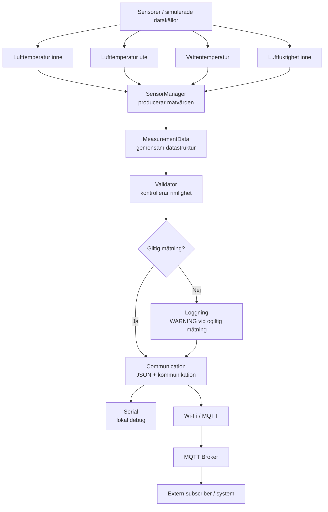

# Systemarkitektur – MicroHydros

## 1. Syfte

Detta dokument beskriver systemarkitekturen för MicroHydros-prototypen.

Arkitekturen stödjer projektets krav på:

- fyra mätpunkter,
- återkommande mätningar,
- gemensam datastruktur,
- validering av mätvärden,
- kontrollerad felhantering,
- strukturerat dataformat,
- kommunikation till ett externt system,
- möjlighet till framtida vidareutveckling.

Arkitekturen är medvetet liten och modulär. Varje huvuddel har ett tydligt ansvarsområde för att underlätta testning, felsökning och framtida förändringar.

---

## 2. Övergripande arkitektur



En ogiltig mätning stoppar alltså inte programmet. Mätningen får `valid = false`, ett varningsmeddelande loggas och systemet fortsätter till nästa mätcykel.

---

## 3. Embedded-plattform

MicroHydros använder:

- ESP32 som målplattform,
- C++,
- Arduino Framework,
- PlatformIO,
- Visual Studio Code som utvecklingsmiljö.

ESP32-versionen byggs genom PlatformIO-miljön:

```text
esp32dev
```

Projektet är strukturerat så att delar av logiken även kan testas som native C++ utan fysisk ESP32.

Detta används bland annat för automatiserade Validator- och integrationstester.

---

## 4. Sensorer och datakällor

### 4.1 Nuvarande prototyp

Den nuvarande implementationen använder simulerade sensordata genom `SensorManager`.

PlatformIO-konfigurationen använder:

```text
USE_SIMULATED_SENSORS=1
```

Det gör att systemets databehandling, validering, mätcykler och kommunikationsarkitektur kan utvecklas och testas även utan fysisk sensorhårdvara.

Simuleringen producerar samtliga fyra mätvärden:

- lufttemperatur inne,
- lufttemperatur ute,
- vattentemperatur,
- relativ luftfuktighet inne.

### 4.2 Valda sensorer för fysisk implementation

Projektets sensorutvärdering har lett till följande val för en fysisk implementation:

- **SHT40** för lufttemperatur och relativ luftfuktighet inne,
- **SHT40** för lufttemperatur ute,
- **DS18B20** för vattentemperatur.

Sensorvalen och motiveringarna dokumenteras närmare i:

```text
docs/05-sensor-comparison.md
docs/07-decision-log.md
```

De fysiska sensorerna är inte integrerade och verifierade i den nuvarande programvarubaserade prototypen.

---

## 5. Systemets huvuddelar

### 5.1 main.cpp

`main.cpp` ansvarar för systemets övergripande körflöde.

Vid uppstart:

1. kommunikationsdelen initieras,
2. `SensorManager` initieras,
3. systemet startar den återkommande huvudloopen.

Under varje mätcykel:

1. `SensorManager` skapar en ny mätning,
2. `Validator` kontrollerar mätningen,
3. giltighetsstatus sparas,
4. ogiltiga mätningar loggas,
5. `Communication` skickar mätningen vidare.

`communication.loop()` körs även mellan mätningarna för att hålla MQTT-anslutningen aktiv.

---

### 5.2 SensorManager

`SensorManager` ansvarar för att producera systemets fyra mätvärden.

Den nuvarande implementationen producerar simulerade värden för:

- `airInsideC`,
- `airOutsideC`,
- `waterC`,
- `humidityInsidePct`.

`SensorManager` ansvarar inte för att avgöra om värdena är giltiga.

Det ansvaret ligger i `Validator`.

Detta minskar kopplingen mellan datainsamling och validering och gör det enklare att senare ersätta simuleringen med riktiga sensorer.

**Kopplade krav:**

- F1
- F2
- F3
- F4
- F5

**Kopplade backlog-items:**

- B09
- B10
- B11
- B12
- B13

---

### 5.3 MeasurementData

`MeasurementData` är den gemensamma datastrukturen som används för en komplett mätning.

Nuvarande struktur:

```cpp
struct MeasurementData {
    unsigned long timestampMs = 0;
    float airInsideC = 0.0f;
    float airOutsideC = 0.0f;
    float waterC = 0.0f;
    float humidityInsidePct = 0.0f;
    bool valid = false;
};
```

Strukturen innehåller:

- timestamp,
- lufttemperatur inne,
- lufttemperatur ute,
- vattentemperatur,
- relativ luftfuktighet inne,
- giltighetsstatus.

Samma struktur används genom systemets hela dataflöde.

**Kopplade krav:**

- F6
- F7

**Kopplat backlog-item:**

- B08

---

### 5.4 Validator

`Validator` ansvarar för teknisk rimlighetskontroll av en komplett `MeasurementData`.

Följande gränser används:

| Mätvärde | Minimum | Maximum |
|---|---:|---:|
| Lufttemperatur inne | -10 °C | 60 °C |
| Lufttemperatur ute | -30 °C | 60 °C |
| Vattentemperatur | 0 °C | 50 °C |
| Relativ luftfuktighet inne | 0 % | 100 % |

En mätning är endast giltig om samtliga fyra värden ligger inom sina gränser.

Resultatet sparas i:

```cpp
data.valid
```

Gränserna är tekniska rimlighetsgränser för prototypen och ska inte tolkas som optimala odlingsförhållanden.

Validator-funktionen är automatiskt testad med Unity.

**Kopplade krav:**

- F8
- F9
- NF1

**Kopplade backlog-items:**

- B14
- B15
- B16

---

### 5.5 Kontrollerad felhantering

När `Validator` markerar en mätning som ogiltig sätts:

```text
valid = false
```

`main.cpp` loggar då:

```text
WARNING: Invalid measurement detected
```

Programmet avslutas inte och mätcykeln blockeras inte.

Flödet blir:

```text
Ogiltigt mätvärde
        |
        v
Validator
        |
        v
valid = false
        |
        v
WARNING loggas
        |
        v
Communication
        |
        v
Nästa mätcykel
```

Integrationstest verifierar att en ogiltig mätning kan följas av en ny giltig mätning.

---

### 5.6 Communication

`Communication` ansvarar för:

- Serial-kommunikation för lokal debug,
- konvertering av `MeasurementData` till JSON,
- Wi-Fi-anslutning,
- MQTT-anslutning,
- publicering av mätdata via MQTT,
- återanslutningsförsök om Wi-Fi eller MQTT kopplas från.

Kommunikationslösningen använder alltså:

```text
ESP32
  |
  v
Wi-Fi
  |
  v
MQTT
  |
  v
MQTT Broker
  |
  v
Extern subscriber
```

MQTT-topic:

```text
microhydros/measurement
```

Serial behålls parallellt för felsökning och lokal verifiering.

Wi-Fi-uppgifter lagras lokalt i:

```text
include/secrets.h
```

Filen ignoreras av Git.

En exempelkonfiguration utan riktiga uppgifter finns i:

```text
include/secrets.example.h
```

**Kopplade krav:**

- F10
- F11
- NF8

**Kopplade backlog-items:**

- B17
- B18
- B19

---

## 6. Dataflöde

Systemets huvudsakliga dataflöde är:

```text
Simulerade sensorer
        |
        v
SensorManager
        |
        v
MeasurementData
        |
        v
Validator
        |
        v
valid = true / false
        |
        v
Communication
        |
        v
JSON
        |
        +------> Serial debug
        |
        v
Wi-Fi / MQTT
        |
        v
MQTT Broker
        |
        v
Extern subscriber
```

Processen är:

1. `SensorManager` producerar fyra mätvärden.
2. Värdena lagras tillsammans i `MeasurementData`.
3. `Validator` kontrollerar samtliga värden.
4. `MeasurementData.valid` sätts till `true` eller `false`.
5. En ogiltig mätning genererar en varningslogg.
6. `Communication` omvandlar mätningen till JSON.
7. JSON skrivs ut över Serial.
8. Mätningen publiceras via MQTT.
9. Systemet fortsätter köra och nästa mätcykel genomförs.

---

## 7. Återkommande mätningar

Den nuvarande utvecklingskonfigurationen använder:

```cpp
constexpr unsigned long MEASUREMENT_INTERVAL_MS = 5000;
```

Det innebär en ny mätning var femte sekund under utveckling och test.

Ett längre intervall på 60 sekunder har valts som normal målkonfiguration för prototypen.

Fem efterföljande mätcykler har verifierats i det automatiserade integrationstestet.

---

## 8. Dataformat

Systemets valda dataformat är JSON.

Exempel:

```json
{
  "timestamp_ms": 1000,
  "air_inside_c": 22.40,
  "air_outside_c": 18.70,
  "water_c": 20.10,
  "humidity_inside_pct": 55.20,
  "valid": true
}
```

Formatet innehåller:

- timestamp,
- alla fyra mätvärden,
- giltighetsstatus.

Samma format används mellan mätcyklerna och är avsett att kunna behandlas av externa system.

---

## 9. MQTT-kommunikation

MQTT valdes som prototypens externa kommunikationslösning.

Den inbyggda kommunikationsmodulen använder Wi-Fi och MQTT för att publicera JSON-data.

MQTT-topic:

```text
microhydros/measurement
```

Kommunikationsprincipen är:

```text
MeasurementData
       |
       v
toJson()
       |
       v
JSON payload
       |
       v
MQTT publish
       |
       v
MQTT Broker
       |
       v
Subscriber
```

MQTT-flödet har även verifierats separat med en lokal Mosquitto-broker i Docker.

Ett JSON-meddelande publicerades och kunde tas emot av en extern MQTT-subscriber.

Den fysiska kedjan där en riktig ESP32 ansluter via Wi-Fi och publicerar hela mätflödet har ännu inte verifierats som end-to-end-test.

---

## 10. Modularitet

Systemet är uppdelat i separata ansvarsområden:

```text
SensorManager     -> datainsamling
MeasurementData   -> gemensam datamodell
Validator         -> validering
Communication     -> format och kommunikation
main.cpp          -> orkestrering och mätcykel
```

Det gör det möjligt att exempelvis:

- byta från simulerade till riktiga sensorer utan att ändra `Validator`,
- ändra valideringsgränser utan att ändra sensorkoden,
- byta kommunikationslösning utan att ändra `SensorManager`,
- lägga till nya externa mottagare,
- byta MQTT-broker,
- utöka systemet med fler mätpunkter.

Den modulära arkitekturen stödjer därmed både underhåll och framtida vidareutveckling.

---

## 11. Testbarhet

Arkitekturen är utformad för att kunna testas både på ESP32 och i en native-testmiljö.

Projektet använder två huvudsakliga native-testmiljöer:

```text
native
```

för `Validator`, samt:

```text
native-flow
```

för integrationstest av dataflödet.

Verifierat programvaruflöde:

```text
SensorManager
      |
      v
MeasurementData
      |
      v
Validator
```

Kommunikationsdelen har dessutom verifierats genom MQTT publish/subscribe med Mosquitto.

Testresultaten dokumenteras i:

```text
docs/06-test-protocol.md
```

---

## 12. Nuvarande begränsningar

Den nuvarande prototypen har följande kända begränsningar:

- sensordata är simulerade i den nuvarande implementationen,
- valda fysiska sensorer är ännu inte integrerade i slutflödet,
- fysisk ESP32 → Wi-Fi → MQTT end-to-end-verifiering återstår,
- längre stabilitetstest återstår,
- MQTT används utan en fullständig produktionsinfrastruktur,
- databaspersistens och dashboard ingår inte i grundprototypen.

Dessa begränsningar hindrar inte att systemets programvaruarkitektur, validering, dataformat och kommunikationsprincip kan testas separat.

---

## 13. Möjlig framtida arkitektur

En framtida version kan exempelvis utökas till:

```text
Fysiska sensorer
      |
      v
ESP32 / MicroHydros
      |
      v
Wi-Fi / MQTT
      |
      v
MQTT Broker
      |
      v
Databas
      |
      v
Dashboard / notifieringar
```

Möjliga framtida förbättringar är:

- riktig sensorintegration,
- databas för historiska mätvärden,
- dashboard,
- notifieringar,
- autentiserad och krypterad MQTT-kommunikation,
- unika topics per MicroHydros-enhet,
- fler mätpunkter.

Dessa delar ingår inte i grundprototypens nuvarande omfattning.

---

## 14. Koppling till projektets dokumentation

Arkitekturen stöds av följande dokument:

```text
docs/02-requirements.md
docs/03-backlog.md
docs/05-sensor-comparison.md
docs/06-test-protocol.md
docs/07-decision-log.md
```

Det kompletta dataflödet verifieras framför allt genom:

```text
B20 – Testa komplett dataflöde
```

Arkitekturen uppdateras i:

```text
B22 – Uppdatera systemarkitektur
```