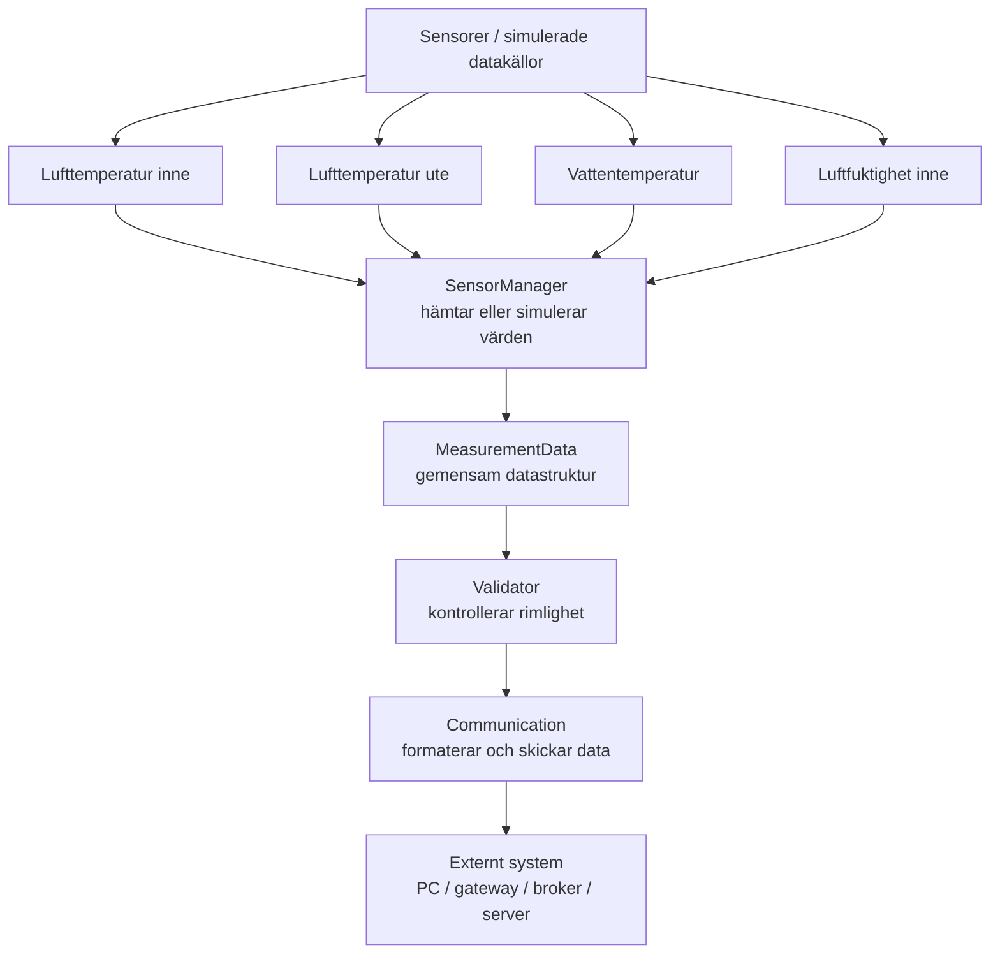

# Systemarkitektur – MicroHydros

## 1. Syfte

Detta dokument beskriver den planerade systemarkitekturen för MicroHydros-prototypen.

Arkitekturen ska stödja projektets krav på:

- fyra mätpunkter,
- återkommande mätningar,
- gemensam datastruktur,
- validering av mätvärden,
- kontrollerad felhantering,
- kommunikation till ett externt system,
- möjlighet till framtida vidareutveckling.

Arkitekturen hålls medvetet liten och modulär.

---

## 2. Grundarkitektur



---

## 3. Embedded-plattform

Projektets nuvarande proof-of-concept använder:

- ESP32 som målplattform,
- C++,
- Arduino Framework,
- PlatformIO.

Detta är inte nödvändigtvis ett slutligt beslut om fysisk hårdvara.

Projektgruppen ska bekräfta med läraren om slutprototypen ska använda:

- fysisk hårdvara,
- simulering,
- eller en kombination.

Arkitekturen ska fungera oavsett om mätvärden kommer från riktiga sensorer eller simulerade datakällor.

---

## 4. Systemets huvuddelar

### 4.1 SensorManager

`SensorManager` ansvarar för att ta fram systemets fyra mätvärden.

Den ska kunna hantera:

- lufttemperatur inne,
- lufttemperatur ute,
- vattentemperatur,
- relativ luftfuktighet inne.

Under tidig utveckling kan värden simuleras.

Om fysisk hårdvara används senare ska samma del kunna anpassas för riktiga sensorer.

**Kopplade krav:**

- F1
- F2
- F3
- F4
- F5

**Kopplade backlog-items:**

- B09
- B10
- B11
- B12
- B13

---

### 4.2 MeasurementData

`MeasurementData` representerar en komplett mätning.

Strukturen ska minst innehålla:

- lufttemperatur inne,
- lufttemperatur ute,
- vattentemperatur,
- relativ luftfuktighet inne.

Den kan även innehålla:

- tidpunkt,
- giltighetsstatus,
- eventuell felstatus.

Exempel:

```cpp
struct MeasurementData
{
    float airInsideC;
    float airOutsideC;
    float waterC;
    float humidityInsidePct;
    bool valid;
};
```

Den exakta implementationen kan ändras under projektet.

**Kopplade krav:**

- F6
- F7

**Kopplade backlog-items:**

- B08

---

### 4.3 Validator

`Validator` ansvarar för att kontrollera om mätvärden verkar rimliga.

Exempel på tydligt ogiltiga värden:

- relativ luftfuktighet under 0 %,
- relativ luftfuktighet över 100 %.

De slutliga valideringsgränserna ska beslutas och motiveras under projektet.

Om ett värde är ogiltigt ska systemet kunna:

- markera mätningen som ogiltig,
- hantera felet kontrollerat,
- fortsätta till nästa mätcykel.

**Kopplade krav:**

- F8
- F9
- NF1

**Kopplade backlog-items:**

- B14
- B15
- B16

---

### 4.4 Communication

`Communication` ansvarar för att formatera och kommunicera en komplett mätning till ett externt system.

Som proof-of-concept kan seriell kommunikation användas.

Projektgruppen ska senare utvärdera den slutliga kommunikationslösningen.

Möjliga alternativ är:

- seriell kommunikation,
- MQTT,
- HTTP/REST,
- Bluetooth/BLE,
- annan relevant lösning.

**Kopplade krav:**

- F10
- F11

**Kopplade backlog-items:**

- B17
- B18
- B19

---

## 5. Dataflöde

Systemets huvudsakliga dataflöde är:

```text
Sensor / simulering
        |
        v
SensorManager
        |
        v
MeasurementData
        |
        v
Validator
        |
        v
Communication
        |
        v
Externt system
```

Processen är:

1. `SensorManager` hämtar eller simulerar fyra mätvärden.
2. Värdena sparas i `MeasurementData`.
3. `Validator` kontrollerar mätvärdena.
4. Mätningen markeras som giltig eller ogiltig.
5. `Communication` formaterar mätningen.
6. Informationen kommuniceras till ett externt system.
7. Processen upprepas efter valt mätintervall.

---

## 6. Exempel på dataformat

Ett möjligt format är JSON:

```json
{
  "air_inside_c": 22.4,
  "air_outside_c": 18.7,
  "water_c": 20.1,
  "humidity_inside_pct": 55.2,
  "valid": true
}
```

Det slutliga formatet bestäms under projektets utveckling.

---

## 7. Felhantering

Felhanteringen ska vara separerad från själva datainsamlingen så långt det är möjligt.

Exempel:

```text
MeasurementData
      |
      v
Validator
      |
      +---- giltig ----> Communication
      |
      +---- ogiltig ---> Felhantering / loggning
                              |
                              v
                       Nästa mätcykel
```

Ett ogiltigt värde ska inte automatiskt avsluta hela programmet.

---

## 8. Modularitet

Arkitekturen delas upp i separata ansvarsområden för att underlätta framtida förändringar.

Det ska exempelvis vara möjligt att:

- byta sensorer utan att skriva om Validator,
- byta kommunikationslösning utan att skriva om SensorManager,
- ändra dataformat utan att ändra sensorkoden,
- lägga till fler mätpunkter,
- ansluta flera MicroHydros-enheter.

---

## 9. Framtida arkitektur

En framtida version skulle exempelvis kunna se ut så här:

```text
MicroHydros-enhet
      |
      v
Wi-Fi / MQTT
      |
      v
MQTT Broker
      |
      v
Databas
      |
      v
Dashboard / notifieringar
```

Detta ingår inte som krav i grundprototypen.

---

## 10. Beslut som återstår

Följande beslut är ännu inte slutligt fastställda:

- vilka sensorer som ska användas,
- om fysisk hårdvara, simulering eller en kombination ska användas,
- vilket mätintervall som används,
- vilka valideringsgränser som används,
- vilken kommunikationslösning som används,
- vilket slutligt dataformat som används.

Besluten dokumenteras i:

`docs/07-decision-log.md`

---

## 11. Koppling till integrationstest

Arkitekturen ska senare verifieras genom ett integrationstest:

```text
SensorManager
      |
      v
MeasurementData
      |
      v
Validator
      |
      v
Communication
      |
      v
Externt system
```

Testet dokumenteras i:

`docs/06-test-protocol.md`

och motsvarar främst backlog-item:

`B20 – Testa komplett dataflöde`